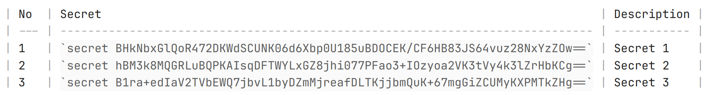
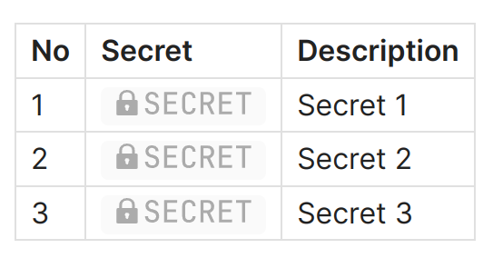
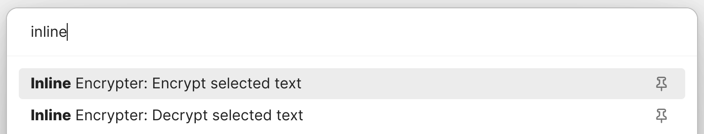
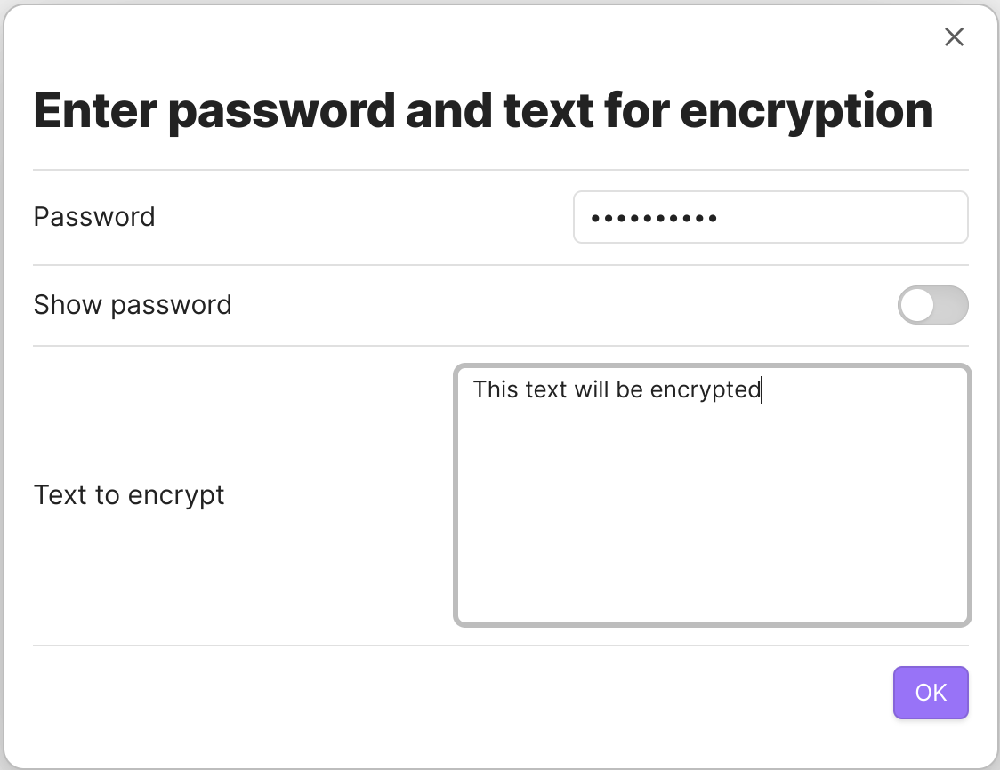
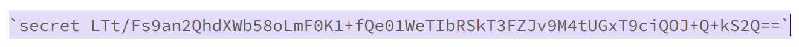
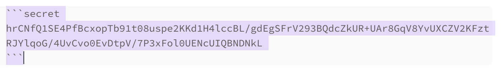
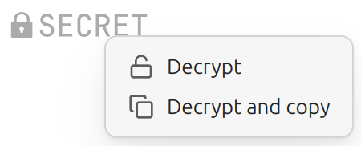

# Obsidian Inline Encrypter Plugin

## Overview

Encrypt your secrets in the [Obsidian.md](https://obsidian.md/) notes.

This is a simple plugin for encrypting the text in Obsidian notes just inline. It was inspired by [Obsidian Encrypt Plugin](https://github.com/meld-cp/obsidian-encrypt).

> ⚠️ WARNING: Use at your own risk. Your passwords are never stored anywhere. If you forget your passwords you can't decrypt your notes. Do not give access to your files to a third party to avoid possible decryption of data.

You can encrypt all the text in a note, as well as parts of it, such as the contents of lists, tables, etc. The encrypted value is saved directly in the note as a block of code and appears as a button in reading mode.

Edit mode:

Reading mode:

Live Preview mode is also supported. Buttons for secrets decryption are clickable in Live Preview mode.

## Usage

### Encryption

1. In edit mode select text you want to encrypt.

2. Run **Encrypt selected text** from command palette.

3. Enter the password for encryption.

4. You can also run **Encrypt selected text as code block** command for encrypting into common code block.

5. There is possibility to insert pre-encrypted text. Run **Insert pre-encrypted text**.

### Decryption

1. To see the decrypted value without decrypting it in the text of the note, simply click on the button in reading mode.

2. Enter the password for decryption.

3. To decrypt a secret in the text of a note, select the entire code block in edit mode.

4. Run **Decrypt selected text** from command palette.

5. Enter the password for decryption.

When the **Ctrl** key is pressed, the secret will not be shown on the screen; it will be copied to the clipboard immediately.

You can also use context menu (right click) to choose decryption method.

## Security Notes

- Decrypted content is only held in memory
- No automatic writing of decrypted content to disk; the only time a decrypted secret is written to disk is when you use the "Decrypt selected text" command
- Passwords are never written to disk; they are kept only in memory
- Makes encryption with a given passphrase, if you lose your passphrase, you lose your data

## Technical Notes

Encryption algorhytm is `aes-256-gcm`. Salt and IV are unique and random.

## Donations

You can make any donations:

- [DonationAlerts](https://dalink.to/solargate)
- [Cryptocurrency](DONATIONS.md)
